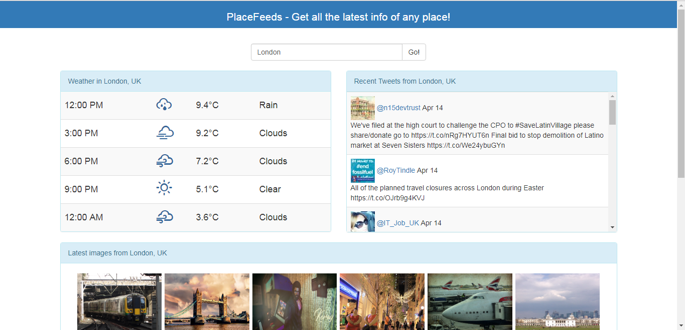
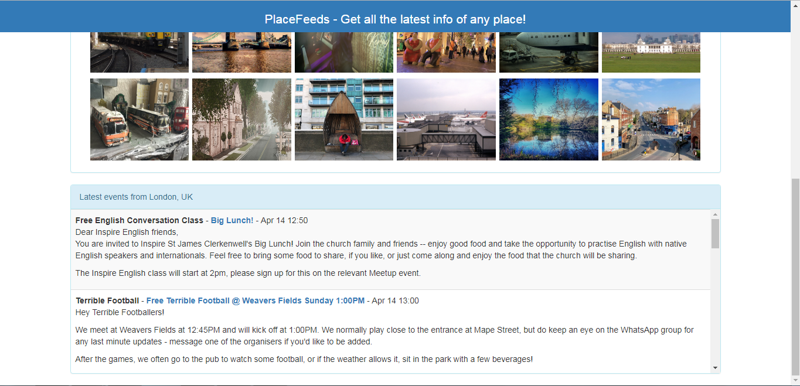

# PlaceFeeds - NO LONGER MAINTAINED

Due to Meetup.com no longer providing a suitable free API, and new versions of Angular and .NET Core, this project is deprecated

Get all the latest info of any place (Angular 4/.NET Core 2.1/webpack)

An SPA to show what's going on at any location you search for - including weather, things to do and latest photos taken in that area.




## APIs used (free)

* [Google Maps (Geocoding API)](https://developers.google.com/maps/documentation/)
* [Twitter](https://developer.twitter.com/en/docs)
* [Openweathermap](https://openweathermap.org/api)
* [Meetup](https://www.meetup.com/meetup_api/)
* [Flickr](https://www.flickr.com/services/api/)

## Setup

* Add a secrets.json file in ```%APPDATA%\Microsoft\UserSecrets\d2432216-127f-4952-914f-928a141b0852\secrets.json```

* Use the following format with your API keys from the above locations:
```
{
  "Location": {
    "ApiKey": "",
    "Secret": ""
  },
  "Weather": {
    "ApiKey": ""
  },
  "Image": {
    "ApiKey": ""
  },
  "Twitter": {
    "ApiKey": "",
    "Secret": ""
  },
  "Meetup": {
    "ApiKey": ""
  }
}
```

## Acknowledgments

* [Guidance from this tutorial](https://channel9.msdn.com/Events/Visual-Studio/Visual-Studio-2017-Launch/WEB-103)
